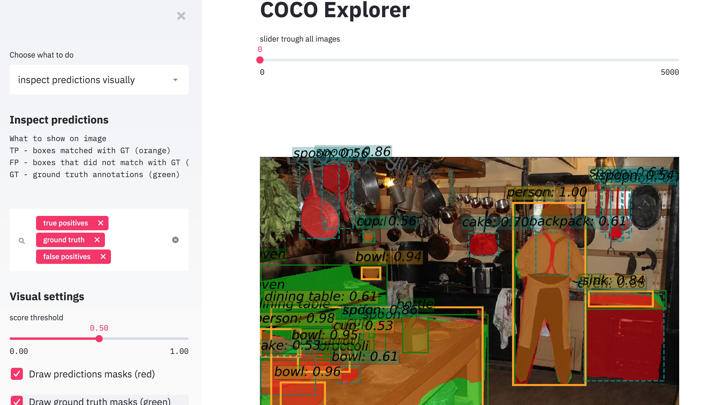
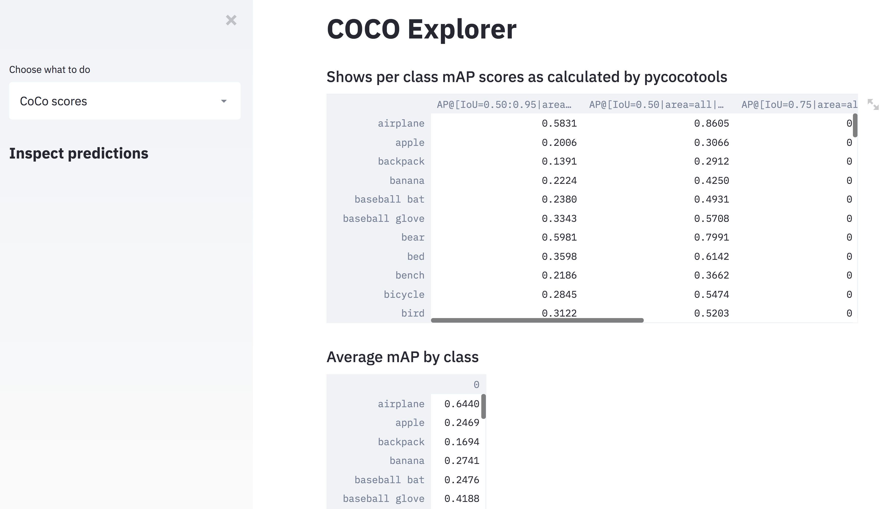

### What is this

This tool given a coco annotations file and coco predictions file will let you explore your dataset, visualize results
and calculate important metrics.


### Running the explorer on example data 

You can use the predictions i prepared and explore the results on the coco validation dataset
the predictions are coming from a Mask RCNN model trained with mmdetection.

1. download (and extract) the labels, annotations and images:

https://drive.google.com/open?id=1wxIagenNdCt_qphEe8gZYK7H2_to9QXl


2. setup using docker
```bash
sudo docker run -p 8501:8501 -it -v "$(pwd)"/coco_data:/coco_data i008/coco_explorer  \
    streamlit run  coco_explorer.py -- \
    --coco_train /coco_data/ground_truth_annotations.json \
    --coco_predictions /coco_data/predictions.json  \
    --images_path /coco_data/images/```

2. setup using conda
```bash
conda env update
conda activate cocoexplorer
streamlit run coco_explorer.py -- --coco_train ./coco_data/ground_truth_annotations.json --coco_predictions ./coco_data/predictions.json  --images_path ./coco_data/val2017/
```
3.
go to localhost:8501


### Running on your own data

In the same way you can explore your own results. Just follow the official COCO dataset format for annotations and predictions.


### Examples





